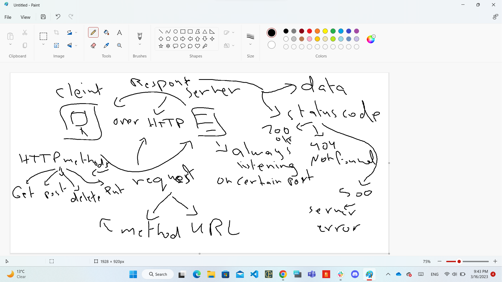

# Movie Library - 01

**Author Name**: Malek Abdelal

### WRRC

## Overview
Movie app that checks the latest movies based on categories.
## Getting Started
**steps to build a Server using Express:**
- npm init -y
- create index.js file
- npm install express 
- write the initial code configration for the server: require (packages and dependencies) and port number.
- Run the server using node index.js

## Project Features
The app has two endpoints ( Home and favorite ) and return response for each other.

------------------------------------------
## Stage 2
### 3rd Party API

## App progress
Connect the application with 3rd party API.